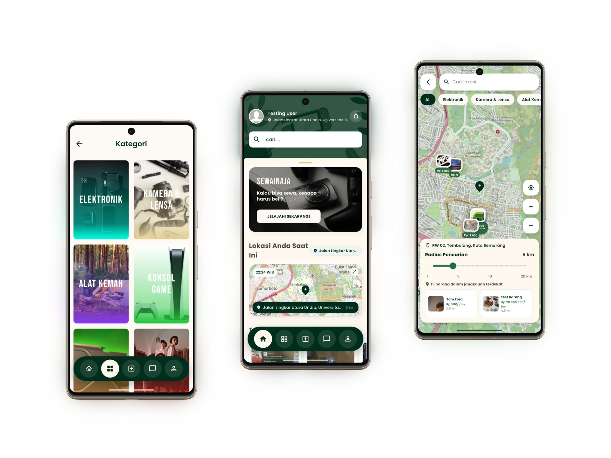

<p align="center">
  
</p>

<p align="center">
  
  
  
  
  
  
</p>

<p align="center">
  <b>Sewa barang dari tetangga, bukan dari toko.</b><br>
  Platform peer-to-peer rental barang berbasis lokasi.
</p>

> Proyek PBL Semester 4 — Teknologi Rekayasa Komputer, Politeknik Negeri Semarang

---

## Overview

Kebanyakan barang rumah tangga hanya dipakai beberapa kali setahun. Di sisi lain, ada orang yang butuh barang itu tapi enggan membeli karena hanya perlu sekali.

SewainAja menghubungkan keduanya. Pemilik barang mendaftarkan listing, penyewa mencari lewat peta, dan serah terima dilakukan dengan QR scan langsung di lokasi. Tidak ada gudang fisik, tidak ada perantara — transaksi terjadi antar tetangga.

Aplikasi ini mencakup seluruh alur sewa dari awal sampai akhir: pencarian barang → chat negosiasi → pembayaran → serah terima QR → bukti kondisi barang → pengembalian → rating.

---

## Features

### Penyewa

- Cari barang terdekat lewat peta interaktif dengan filter kategori
- Ajukan sewa dengan memilih tanggal & waktu
- Chat langsung dengan pemilik (teks + gambar)
- Bayar via Midtrans (QRIS, transfer bank, e-wallet)
- Scan QR pemilik untuk memulai masa sewa
- Upload foto kondisi barang sebelum & sesudah pakai
- Perpanjang sewa dari dalam transaksi yang sedang berjalan
- Beri rating untuk pemilik dan kualitas barang

### Pemilik

- Posting barang dengan foto, harga, kategori, dan lokasi
- Terima atau tolak request sewa setelah review profil penyewa
- Scan QR penyewa saat barang dikembalikan
- Lacak lokasi penyewa secara live jika telat mengembalikan
- Ajukan klaim kerusakan (maks 12 jam setelah checkout)
- Terima pembayaran ke wallet virtual

### Admin

- Verifikasi identitas pengguna (review KTP + selfie)
- Mediasi sengketa dan klaim kerusakan
- Kelola kategori barang

### Autentikasi

- Registrasi email/password dengan verifikasi OTP SMS
- Google Sign-In
- Progressive trust: `unverified` → upload KTP → `pending` → admin approve → `verified`

---

## Screenshots

<p align="center">
  
</p>

| Screen           | Deskripsi                                        |
| ---------------- | ------------------------------------------------ |
| Splash           | Animasi cinema-style dengan transisi gradient    |
| Login & Register | Slide-up sheet, OTP verification                 |
| Home             | Nearby items, kategori, from following           |
| Map Explore      | Peta OpenStreetMap dengan marker barang          |
| Item Detail      | Gallery, info pemilik, rating, tombol sewa       |
| Transaction      | QR check-in → masa sewa → evidence → QR checkout |
| Chat             | Real-time messaging                              |
| GPS Tracking     | Peta live lokasi penyewa saat overdue            |
| Wallet           | Saldo virtual & riwayat                          |

---

## Tech Stack

| Layer              | Technology                                      |
| ------------------ | ----------------------------------------------- |
| Framework          | Flutter (Dart SDK `^3.11.5`)                    |
| State Management   | Provider                                        |
| Maps               | flutter_map + OpenStreetMap                     |
| GPS                | geolocator                                      |
| Networking         | http                                            |
| Local Storage      | shared_preferences                              |
| Auth               | firebase_auth, google_sign_in                   |
| Database           | cloud_firestore                                 |
| Realtime DB        | firebase_database (GPS live tracking)           |
| File Storage       | firebase_storage                                |
| Push Notifications | firebase_messaging, flutter_local_notifications |
| QR Code            | mobile_scanner, qr_flutter                      |
| Payment            | webview_flutter (Midtrans Snap)                 |
| Image              | image_picker, flutter_image_compress            |
| Search             | fuzzy (client-side fuzzy search)                |
| Fonts              | Poppins, BebasNeue                              |

---

## Getting Started

### Prasyarat

- Flutter SDK `^3.11.5`
- Android Studio atau Xcode
- `google-services.json` di `android/app/` (dari Firebase Console)
- `GoogleService-Info.plist` di `ios/Runner/` (dari Firebase Console)

### Instalasi

```bash
git clone https://github.com/sewainaja-pbl/sewainaja-mobile.git
cd sewainaja-mobile

flutter pub get
flutter run
```

### Build Release

```bash
flutter build apk --split-per-abi
```

---

## Configuration

Aplikasi ini tidak menggunakan file `.env`. Konfigurasi dikelola melalui:

| Konfigurasi      | File                                  | Keterangan                          |
| ---------------- | ------------------------------------- | ----------------------------------- |
| Firebase Project | `lib/firebase_options.dart`           | Auto-generated oleh FlutterFire CLI |
| Android Firebase | `android/app/google-services.json`    | Download dari Firebase Console      |
| iOS Firebase     | `ios/Runner/GoogleService-Info.plist` | Download dari Firebase Console      |
| API Base URL     | `lib/api_config.dart`                 | Cloud Functions endpoint            |

Untuk mengubah target backend, edit `lib/api_config.dart`:

```dart
class ApiConfig {
  static const String baseUrl = 'https://api-ig7gj3foea-uc.a.run.app';
  // static const String baseUrl = 'http://10.0.2.2:3000/api'; // Local dev
}
```

---

## Repository Structure

```
sewainaja-mobile/
├── lib/
│   ├── main.dart                    # Entry point, Firebase init, Provider setup
│   ├── api_config.dart              # Backend API base URL
│   ├── data/
│   │   ├── models/                  # Data classes
│   │   └── repositories/           # Abstraksi akses data (auth, item, transaction, chat, rating, user)
│   ├── presentation/
│   │   └── controllers/            # Provider ChangeNotifiers (auth, category)
│   ├── widgets/                     # Reusable components (product card, skeleton loader, dll)
│   ├── home_screen.dart             # Beranda
│   ├── map_explore_screen.dart      # Peta pencarian barang
│   ├── transaction_detail_screen.dart # Detail & alur transaksi
│   ├── room_chat_screen.dart        # Chat real-time
│   └── ...                          # 69 screen files total
├── assets/
│   ├── images/
│   └── fonts/
└── pubspec.yaml
```

Detail teknis arsitektur tersedia pada [dokumentasi terpisah](https://github.com/sewainaja-pbl/sewainaja-docs).

---

## Related Repositories

| Repository                                                          | Deskripsi                                                      |
| ------------------------------------------------------------------- | -------------------------------------------------------------- |
| [sewainaja-admin](https://github.com/sewainaja-pbl/sewainaja-admin) | Admin Dashboard (Next.js) + Backend REST API (Cloud Functions) |

---

## Team

| Nama                 | NIM          | Role                |
| -------------------- | ------------ | ------------------- |
| **Bagaskara**        | 4.33.24.2.04 | Fullstack Developer |
| **Ghufron Ainun N.** | 4.33.24.2.10 | Fullstack Developer |
| **Roihan Saputra**   | 4.33.24.2.20 | Fullstack Developer |
| **Dimas Adhie N.**   | 4.33.24.2.08 | Fullstack Developer |

**Dosen Pembimbing:** Suko Tyas Pernanda, S.ST., M.Cs & Wiktasari, S.T., M.Kom
**Program Studi:** Teknologi Rekayasa Komputer, Politeknik Negeri Semarang
**Periode:** Semester 4, 2025/2026

---

## License

Proyek akademik — hak cipta dilindungi oleh tim pengembang.
